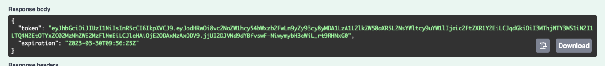

# Core7 Identity JWT Basic Auth
- This is a sample project to demonstrate how to use JWT with Basic Authentication in Core7.

- The project is based on the Core7 Identity JWT project. The only difference is that the authentication is done using Basic Authentication instead of JWT.
